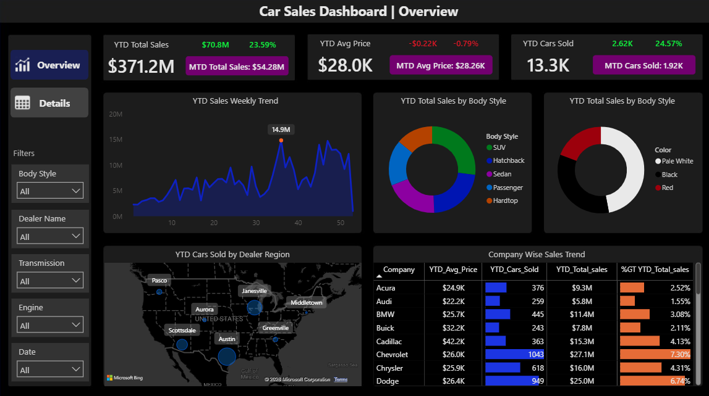
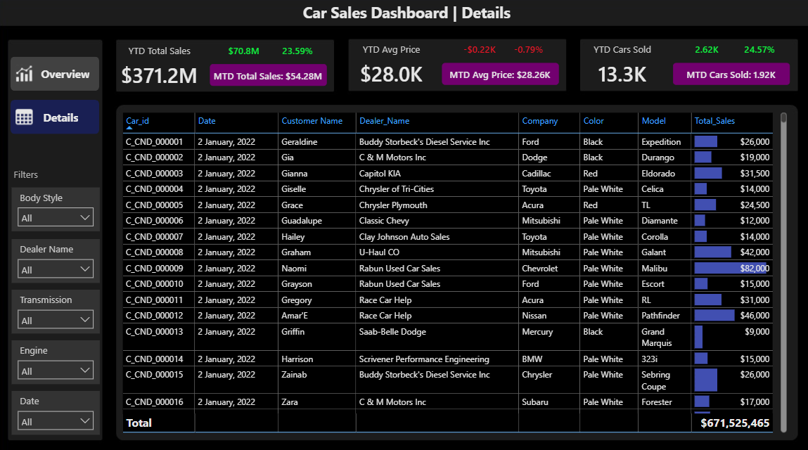

# Car Sales Performance & Revenue Growth Analysis | Automotive Retail Industry

## Executive Summary

* **The Business Problem:** The dealership network suffered from fragmented sales visibility, unoptimized inventory distribution across regional hubs, and a lack of real-time tracking for Year-to-Date (YTD) and Month-to-Date (MTD) revenue performance.
* **The Solution:** Engineered an end-to-end Power BI Business Intelligence solution with a centralized data pipeline, robust dimensional data modeling, and interactive executive dashboards to track sales KPIs, regional trends, and brand performance.
* **The Number Impact:** Uncovered actionable insights across **$371.2M YTD revenue** (a **23.59% YoY growth**), identified a **$14.9M peak sales opportunity window**, and pinpointed top-revenue drivers (**Chevrolet at 7.30% market share**).
* **Next Steps:** Implement dynamic inventory re-allocation to high-performing regional hubs, launch targeted promotions ahead of seasonal Week 35 volume peaks, and automate DAX-driven anomaly alerts for underperforming brands.




---

## Business Problem
Automotive dealerships operate on tight margins where inventory holding costs and misaligned regional demand directly degrade profitability. Key executive decision-makers lacked a single source of truth (SSOT) to analyze:
1. Historical vs. YTD revenue performance and volume momentum.
2. Regional supply-demand imbalances across dealership hubs.
3. Shifts in customer preferences regarding vehicle body styles, colors, and price points.

Without automated reporting, leadership faced delayed strategic decision-making and ineffective marketing spend.

---

## Methodology

```text
+-------------------+      +----------------------+      +-------------------------+      +-----------------------+
|  Raw CSV Data     | ---> |  Power Query (ETL)   | ---> | Data Modeling (Star)    | ---> | DAX Engine & Metrics  |
|  Sales Records    |      | Clean, Transform, Type|      | 1:N Calendar Relation   |      | YTD/MTD Calculations  |
+-------------------+      +----------------------+      +-------------------------+      +-----------------------+
                                                                                                     |
                                                                                                     v
                                                                                          +-----------------------+
                                                                                          | Interactive Dashboard |
                                                                                          | Executive Insights    |
                                                                                          +-----------------------+
```

---
## Skills

* **Data Engineering & ETL:** Data Cleansing, Schema Transformation, Data Type Validation, Data Sanitation.
* **Data Modeling:** Star Schema Architecture, Dimensional Modeling, Fact vs. Dimension Tables, Relationship Optimization.
* **DAX & Analytics:** Time-Intelligence Functions (`TOTALYTD`, `TOTALMTD`), Measure Branching, KPI Formulation, Context Transition (`CALCULATE`).
* **Data Visualization & UX:** Executive Dashboard Design, Visual Hierarchy, Interactive Slicers, UX Formatting, Dark-Mode Palette.
* **Business Strategy:** Revenue Growth Analysis, Regional Demand Profiling, Product Mix Optimization.

---

## Results & Business Recommendations

Key Performance Indicators (YTD)

├── Revenue: $371.2M (+23.59% YoY)

├── Volume:  13.3K Units (+24.57% YoY)

└── ASP:     $28.0K (-0.79% YoY)

### Strategic Recommendations:
1. **Capitalize on Seasonality Peaks:** Sales volume hits a historical peak during Week 35 ($14.9M). Dealerships should align trade-in campaigns and marketing budgets 3–4 weeks prior to maximize high-conversion periods.
2. **Optimize Inventory Mix by Regional Demand:**
   * **Austin** and **Janesville** hubs demonstrate the highest sales volume density. Prioritize SUV and Sedan inventory shipments to these locations.
   * Allocate luxury inventory (**Cadillac at $42.2K ASP**) specifically to high-margin regional dealerships to reduce holding days.
3. **Double-Down on High-Performing Brands:** **Chevrolet ($27.1M)** and Dodge ($25.0M) contribute over 14% of total sales revenue. Secure stronger distributor allotments for these core volume drivers.
4. **Color & Body Style Alignment:** **Pale White** is the dominant consumer choice across all body styles. Ensure manufacturing/dealer orders reflect a minimum 40% allocation to white exterior finishes.

---

## Next Steps

1. **Power BI Service Deployment:** Publish the dataset to Power BI Service, configure scheduled daily data refreshes via On-Premises Data Gateway, and establish Row-Level Security (RLS) for regional managers.
2. **Advanced Predictive Analytics:** Integrate Python/R scripts inside Power BI or Synapse Analytics to build a Sales Forecasting model for Q3/Q4 demand.
3. **Automated Alerting:** Set up Data Alerts in Power BI Service to notify regional directors via Microsoft Teams whenever weekly revenue drops below target thresholds.
